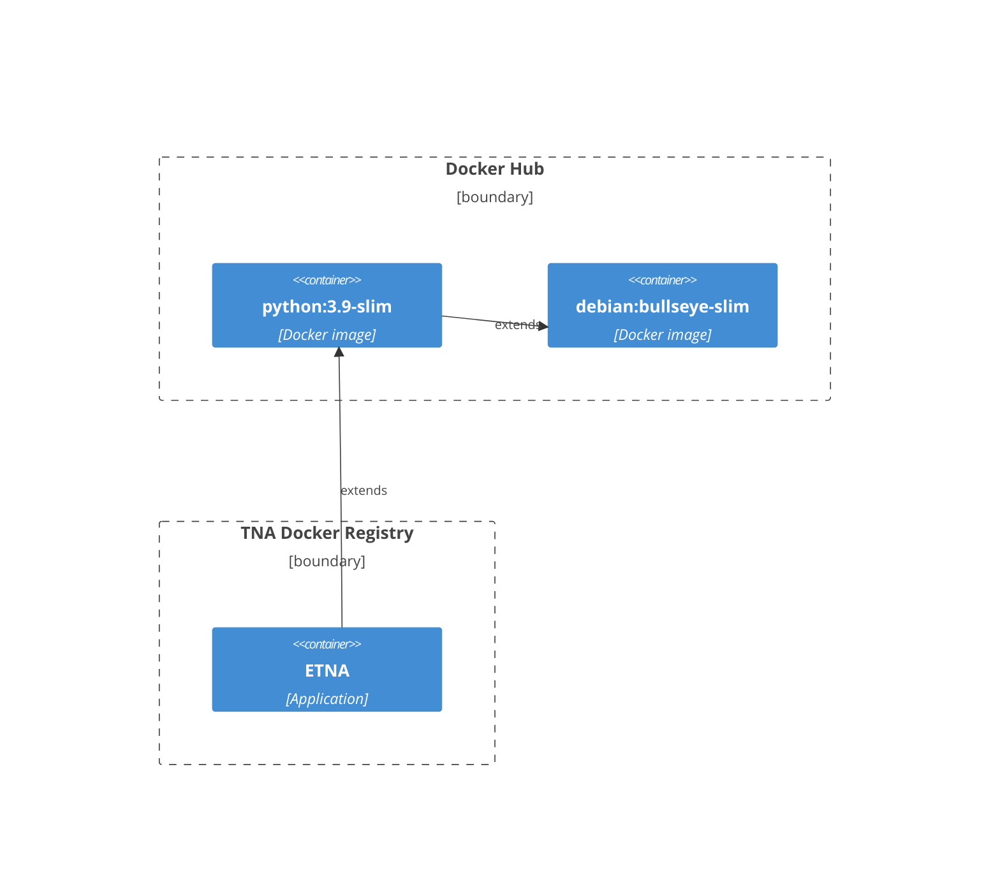
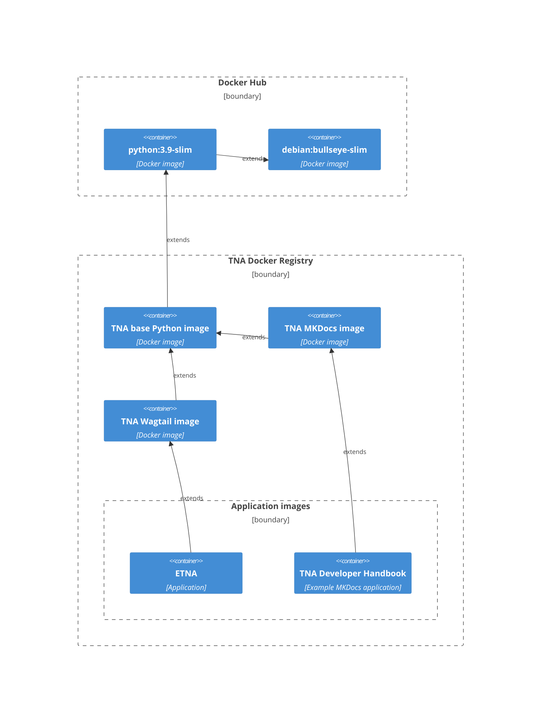

# Docker structure plan

There is a need to standardise our technology stacks in a way that is secure, maintainable and reusable.

Currently each application could have its own Docker implementation and differences exist between them that makes updating and deploying them more of a task than it should be.

## Example: ETNA

ETNA currently [extends the base python 3.11 Docker image](https://github.com/nationalarchives/ds-wagtail/blob/develop/Dockerfile#L1) and contains an entire Dockerfile full of custom configuration.

The inheritance for ETNA can simply be described as:

If we were to make another service that needed to use the same technology stack then it would currently be a copy-paste job (or fork). This new application cannot easily share updates and fixes that are made to ETNA.

## Possible solution

My idea is to create a number of Docker images, each built upon another which will give us a good platform for which to make applications.

This approach allows us to make updates at either our language or framework level images and simply inherit the new features or fixes in each application.

It would ensure that (for example) every Wagtail site we make would work in the same way and could therefore be more reliably developed and deployed. Updates to one could potentially flow through to the others with minimal effort.

### Example: Python

#### TNA base Python image

If we choose to use [Poetry](https://python-poetry.org/) for our dependency management on all Python projects then we can use this image to set it up in a consistent manner and ensure all applications use the same version.

#### TNA Wagtail image

Creating a standardised Wagtail image will allow us to quickly and easily get a new application started. All the generic configuration can be done at this stage and we can ensure that all our Wagtail applications run in a consistent manner (e.g. using [Gunicorn](https://gunicorn.org/)).

#### TNA MKDocs image

The MKDocs image layer is an example of other application types that could benefit from the inheritence of higher level images.

Similarly to the Wagtail image, all our MKDocs sites would receive the same benefits from the Poetry setup done at a higher stage and we could spin up MKDocs sites with greater ease.

### Security

By defining upfront what our "approved" dependencies are, we have more control over security.

### Future

In the same way that all Wagtail applications could extend the same Wagtail base Docker image, this approach would allow us to make other framework Docker images in the future.

For example, if we had a need to make a Python/Flask project in the future, we could inherit all the features from our base Python image. Similarly if we needed a more specific version of Wagtail for some special applications (for example, to host on [platform.sh](https://platform.sh/)) then we could simply extend our base Wagtail image.
